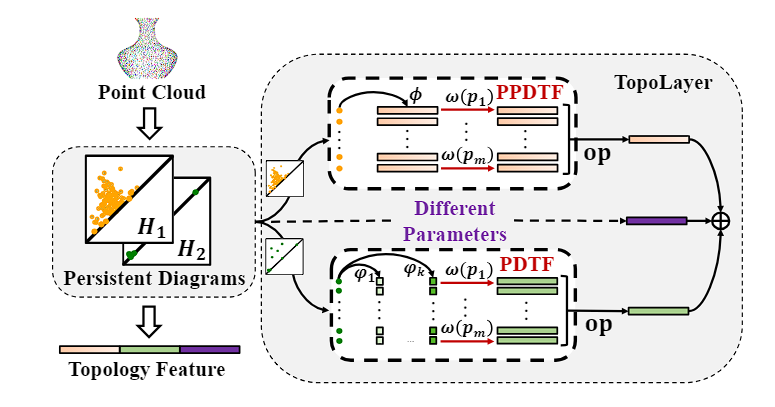
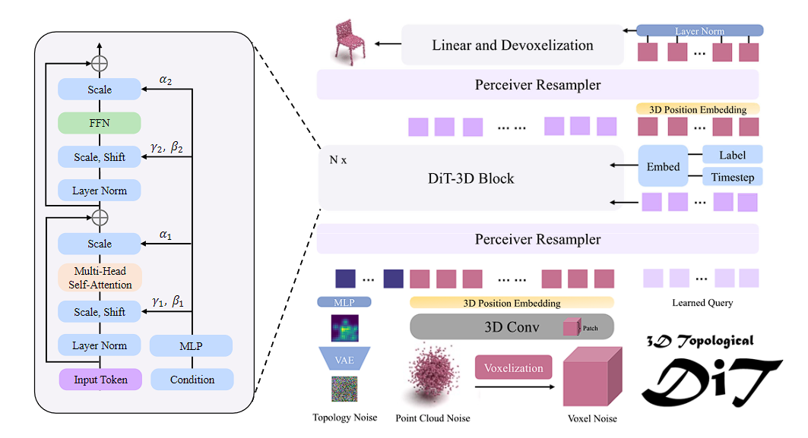
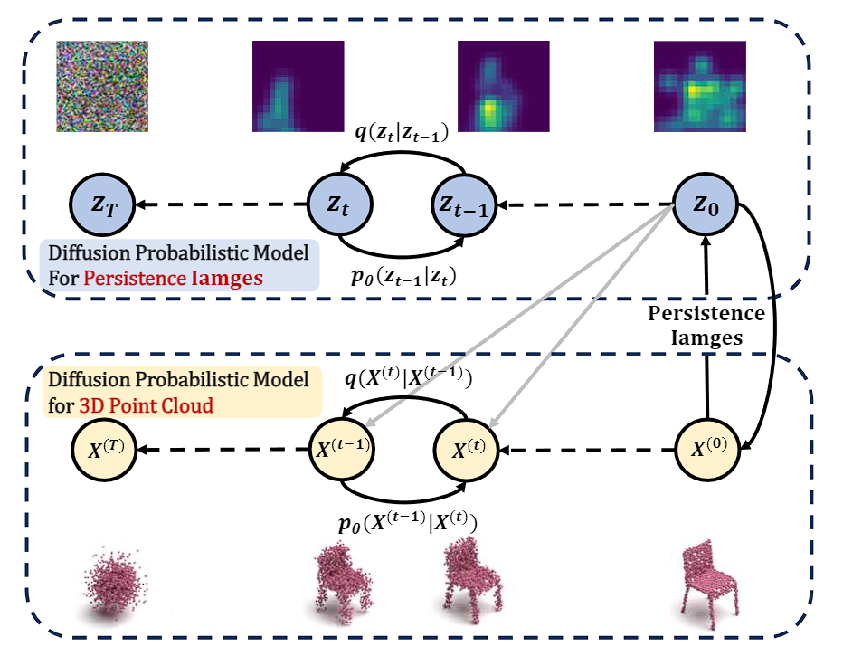

I am a third-year master's student from the [School of Mathematics](https://math.seu.edu.cn/), [Southeast University](https://www.seu.edu.cn/). My primary research interests are in 3D computer vision, multimodal large models, AIGC, embodied intelligence, topological data analysis and machine learning. 

I believe that deep learning models can leverage multimodal information—such as text, images, point clouds, and topology—to understand 3D spatial information, thereby enhancing the models' capabilities for "**Discrimination👁**," "**Imagination🤔**," and "**Creation🤖**."

I am fortunate to be advised by [Prof. Liu](https://math.seu.edu.cn/lqs_2339_en/list.htm) at the Key Laboratory of Collective Intelligence of Cyberspace, Jiangsu Province.

You can find my CV here: [Curriculum Vitae](../assets/CV_GuanZechao.pdf), [简历](../assets/关则潮_东南大学_数学_2025年毕业.pdf)

[Email](mailto:zechaoguan@seu.edu.cn) / [Github](https://github.com/Anonymous-AAAI-project/TopoLayer) / [Wechat](../images/wechat.jpg)

# Research Interests——3D Computer Vision
- **Discrimination👁**: *Multimodal Large Models* and *Foundational Framework Models*
- **Imagination🤔**: *Generative Models* and *AIGC*
- **Creation🤖**：*Embodied Intelligence*
- **Mathematics🧠**: *Topological Data Analysis in Machine Learning and so on*

# Internship Experience
## Beijing Meituan - Computer Vision Research Intern 🤖
- **Department**: Core Local Business / Basic R&D Platform / Visual Intelligence Department / MM / EA
- **Period**: April 2024 - Present
- **Responsibilities**:
  - Contributing to the development of **embodied intelligence multimodal models** RoboUniView and RoboUniView2.0.
  - Converting visual images into point clouds and voxels, utilizing UVFormer for voxel prediction, and extracting visual-text features using the OpenFlamingo model for predicting robot actions and image content.
  - Enhancing autonomous driving technology for pothole detection by pretraining and fine-tuning the LLaVA model, and improving detection accuracy with high-resolution ViT models.
 
# Research Experience
## **Discrimination👁**
### 📃 TopoLayer: A Universal Neural Network Layer for Advanced Topology Feature Learning on Point Clouds using Persistent Homology
2025AAAI / UnderReview / first author

    

Point cloud is complex 3D data characterized by its irregularity and unordered structure. In contrast to previous efforts aimed at extracting local geometric information by sophisticated techniques, which have reached a saturation point in efficacy, we delve into the rich topological information of point clouds using persistent homology. First, we introduce two novel vectorization methods, PPDTF and PDTF, to transform topological information into a format suitable for deep neural networks. Then we propose TopoLayer, a simple but effective and universal neural network layer seamlessly integrated into existing architectures. Integration of TopoLayer, without architectural modifications, significantly improves established models such as PointMLP and PointNet++. For classification on ModelNet40, the class mean accuracy of PointMLP notably improves from 91.3\% to 91.8\%, surpassing the state-of-the-art PointMixer. Additionally, PointNet++ achieves a remarkable gain of 2.7\%. For part segmentation on ShapeNetPart, PointMLP achieves a new state-of-the-art performance with 85.1\% Cls.mIoU, while PointNet++ secures a significant 0.9\% increase. Moreover, TopoLayer also demonstrates its effectiveness in the case of loss of geometric information.

## **Imagination🤔**
### 📃 TopoDiT-3D: Topology-Aware Diffusion Transformer with Bottleneck Structure for 3D Shape Generation
2025AAAI / UnderReview / first author

    

DiT-3D, a pioneer of diffusion transformer architecture for 3D shape generation, has demonstrated significant performance. However, the voxel-based operations of DiT-3D induce redundant and information-less tokens while reducing training efficiency. Additionally, DiT-3D is unable to extract and integrate global topological information for feature learning. To address these limitations, we propose TopoDiT-3D, an innovative Topology-Aware Diffusion Transformer architecture with a bottleneck structure for 3D shape generation. Specifically, we design the bottleneck structure utilizing Perceiver Resampler, which not only adaptively filters out redundant patch tokens to improve training efficiency, but also offers a mode to integrate topological information extracted through persistent homology into feature learning. Our method achieves state-of-the-art performance, surpassing the DiT-3D model in both effectiveness and training efficiency on the ShapeNet dataset. For the airplane category, our TopoDiT-3D reduces the 1-Nearest Neighbor Accuracy of the state-of-the-art method by 9.17 and increases the Coverage metric by 11.54 when using the Chamfer Distance. Our work demonstrates the feasibility of the bottleneck structure in diffusion transformers and the significance of luxuriant topological information for 3D shape generation, rather than only focusing on local information.

### 📃 TopoDDPM: Diffusion Probabilistic Models using Persistent Homology for 3D Point Cloud Generation
Be in progress / first author

    

TopoDDPM is divided into two phases, the first stage is to use topological features as shape latent variables to establish a probabilistic diffusion model for point cloud generation. The second stage is to establish a probabilistic diffusion model for topological feature generation.

# Awards and Honors
- National Graduate Mathematical Modeling Competition, Second Prize
- National Undergraduate Mathematical Modeling Competition, Second Prize
- American Undergraduate Mathematical Modeling Competition, Second Prize
- Guangdong University of Technology Top Ten Youth
- Alpha Excellent Student Scholarship

# Skills
- Solid foundation in mathematics and data modeling
- Proficient in 3D point cloud deep learning models and generative models (GAN, VAE, DDPM, LDM, DiT)
- Experienced with discriminative models (PointMLP, Point Transformer, PointNet/PointNet++, Transformer, CNN)
- Proficient in Python and Pytorch deep learning framework
- Familiar with NLP and CV models (GPT, Bert, ViT) and multimodal models (CLIP, OpenFlamingo, Stable Diffusion, LLaVA)
- Strong English proficiency (CET-4, CET-6), currently preparing for IELTS

